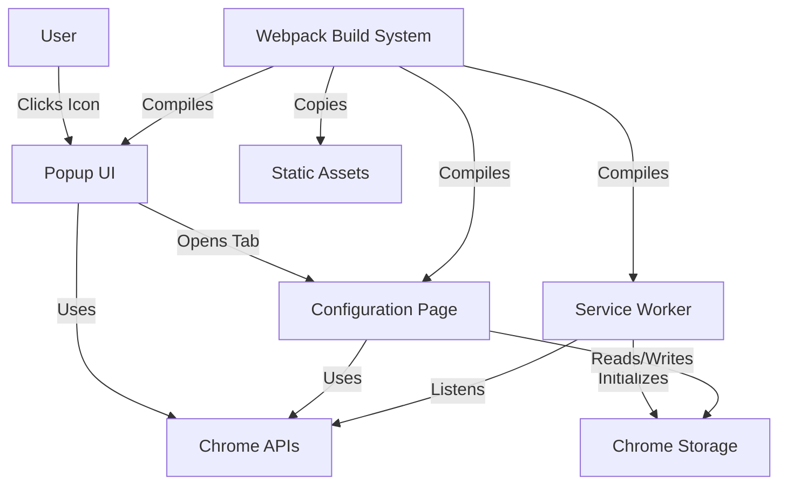

# Design Document

## Overview

This design document describes the architecture and implementation approach for a foundational Chrome Extension project using TypeScript, Webpack 5, and Chrome Manifest V3. The extension provides a minimal but complete implementation demonstrating core extension concepts: a popup UI, configuration page, background service worker, and persistent storage.

The design prioritizes simplicity, type safety, and adherence to modern Chrome extension best practices. The resulting codebase serves as a production-ready template for building more complex extensions.

## Architecture

### High-Level Architecture

The extension follows Chrome's standard Manifest V3 architecture with three main components:



### Component Interaction Flow

1. **Extension Installation**: Service Worker receives onInstalled event and initializes default settings
2. **User Interaction**: User clicks extension icon, triggering popup display
3. **Navigation**: User clicks button in popup, opening configuration page in new tab
4. **Settings Management**: Configuration page reads/writes settings via Chrome Storage API
5. **Build Process**: Webpack compiles TypeScript to JavaScript and bundles all assets

### Technology Stack

- **Language**: TypeScript 5.x with strict mode
- **Build Tool**: Webpack 5 with ts-loader
- **Extension Platform**: Chrome Manifest V3
- **Module System**: CommonJS (required for Chrome extensions)
- **Target**: ES6

## Components and Interfaces

### 1. Popup Component

**Purpose**: Provides the primary user interface displayed when clicking the extension icon.

**Files**:
- `src/popup/popup.html` - HTML structure
- `src/popup/popup.ts` - TypeScript logic
- `src/popup/popup.css` - Styling

**Interface**:
```typescript
// DOM Elements
interface PopupElements {
  openConfigButton: HTMLButtonElement;
}

// No exported functions - self-contained module
```

**Responsibilities**:
- Display "Hello World" heading and welcome message
- Provide button to open configuration page
- Handle button click events
- Use Chrome Tabs API to create new tabs

### 2. Configuration Page Component

**Purpose**: Provides a full-page interface for extension settings and configuration.

**Files**:
- `src/config/config.html` - HTML structure
- `src/config/config.ts` - TypeScript logic
- `src/config/config.css` - Styling

**Interface**:
```typescript
// DOM Elements
interface ConfigElements {
  enableFeatureCheckbox: HTMLInputElement;
}

// Storage Schema
interface StorageSchema {
  enableFeature: boolean;
}
```

**Responsibilities**:
- Display "Hello World" heading and description
- Provide settings controls (checkbox for feature toggle)
- Load saved settings from Chrome Storage on page load
- Save settings to Chrome Storage when modified
- Provide visual feedback for user interactions

### 3. Service Worker Component

**Purpose**: Handles background tasks and extension lifecycle events.

**Files**:
- `src/background/background.ts` - Service worker logic

**Interface**:
```typescript
// Chrome Event Listeners
chrome.runtime.onInstalled: (details: chrome.runtime.InstalledDetails) => void
chrome.runtime.onMessage: (request: any, sender: chrome.runtime.MessageSender, sendResponse: (response: any) => void) => boolean

// Storage Initialization
interface DefaultSettings {
  enableFeature: boolean;
}
```

**Responsibilities**:
- Listen for extension installation events
- Initialize default settings on first install
- Log installation and update events
- Handle runtime messages (extensibility point)
- Maintain service worker lifecycle

### 4. Build System

**Purpose**: Compile TypeScript, bundle code, and prepare extension for distribution.

**Configuration Files**:
- `webpack.common.js` - Shared configuration
- `webpack.dev.js` - Development-specific settings
- `webpack.prod.js` - Production-specific settings
- `tsconfig.json` - TypeScript compiler options

**Build Outputs**:
```
dist/
├── manifest.json
├── popup/
│   ├── popup.html
│   ├── popup.css
│   └── popup.js
├── config/
│   ├── config.html
│   ├── config.css
│   └── config.js
├── background/
│   └── background.js
└── icons/
    ├── icon-16.png
    ├── icon-32.png
    ├── icon-48.png
    ├── icon-128.png
    └── icon-512.png
```

**Webpack Entry Points**:
- `popup/popup`: Popup UI bundle
- `config/config`: Configuration page bundle
- `background/background`: Service worker bundle

**Key Configuration Decisions**:
- **No code splitting**: Extensions require self-contained bundles
- **No runtime chunks**: Incompatible with Manifest V3 service workers
- **Source maps**: Inline for development, separate files for production
- **Watch mode**: Enabled for development builds

## Data Models

### Storage Schema

The extension uses Chrome's sync storage for cross-device settings synchronization.

```typescript
interface ExtensionStorage {
  enableFeature: boolean;  // User's feature toggle preference
}
```

**Storage Operations**:
```typescript
// Read from storage
chrome.storage.sync.get(['enableFeature'], (result) => {
  const enabled: boolean = result.enableFeature ?? true;
});

// Write to storage
chrome.storage.sync.set({ enableFeature: true });
```

### Manifest Schema

The extension manifest follows Manifest V3 specification:

```typescript
interface ManifestV3 {
  manifest_version: 3;
  name: string;
  version: string;
  description: string;
  action: {
    default_popup: string;
    default_icon: Record<string, string>;
  };
  icons: Record<string, string>;
  background: {
    service_worker: string;
    type: "module";
  };
  permissions: string[];
  host_permissions: string[];
  web_accessible_resources: Array<{
    resources: string[];
    matches: string[];
  }>;
}
```

## Correctness Properties

*A property is a characteristic or behavior that should hold true across all valid executions of a system-essentially, a formal statement about what the system should do. Properties serve as the bridge between human-readable specifications and machine-verifiable correctness guarantees.*

### Acceptance Criteria Testing Prework


Based on the prework analysis, most acceptance criteria are example-based tests of specific configurations and UI elements rather than universal properties. However, several key properties emerge:

### Property 1: TypeScript Compilation Success
*For any* valid TypeScript source file in the src directory, the build system should compile it to JavaScript without errors.
**Validates: Requirements 1.1**

### Property 2: Source Map Generation
*For any* compiled JavaScript file in the dist directory, a corresponding source map file should exist.
**Validates: Requirements 1.4**

### Property 3: Storage Round-Trip Consistency
*For any* setting value written to Chrome storage, reading that setting immediately after should return the same value.
**Validates: Requirements 4.1, 4.2, 4.3**

### Property 4: Static Asset Preservation
*For any* static asset file (HTML, CSS, icons) in the source directories, that file should be copied to the corresponding location in the dist directory during build.
**Validates: Requirements 6.5, 7.5**

### Property 5: Entry Point Bundle Integrity
*For any* webpack entry point defined in the configuration, exactly one output JavaScript file should be generated without code splitting.
**Validates: Requirements 6.7**

### Property 6: Service Worker Message Response
*For any* message sent to the service worker via chrome.runtime.sendMessage, the service worker should respond with a status acknowledgment.
**Validates: Requirements 9.5**

## Error Handling

### Build Errors

**TypeScript Compilation Errors**:
- **Detection**: TypeScript compiler reports errors during build
- **Handling**: Build process fails with clear error messages indicating file and line number
- **Recovery**: Developer fixes TypeScript errors and rebuilds

**Webpack Bundling Errors**:
- **Detection**: Webpack reports module resolution or bundling errors
- **Handling**: Build process fails with error details
- **Recovery**: Developer resolves dependency issues and rebuilds

### Runtime Errors

**Chrome API Errors**:
- **Storage API Failures**:
  - **Detection**: Chrome storage API returns error in callback
  - **Handling**: Log error to console, use default values
  - **User Impact**: Settings may not persist, but extension remains functional

- **Tabs API Failures**:
  - **Detection**: chrome.tabs.create fails
  - **Handling**: Log error to console
  - **User Impact**: Configuration page may not open, but popup remains functional

**DOM Errors**:
- **Missing Elements**:
  - **Detection**: getElementById returns null
  - **Handling**: Check for null before adding event listeners
  - **User Impact**: Graceful degradation, no crashes

**Service Worker Errors**:
- **Initialization Failures**:
  - **Detection**: Service worker fails to start
  - **Handling**: Chrome logs error, extension may not function
  - **Recovery**: User reloads extension

### Development Errors

**Extension Loading Errors**:
- **Invalid Manifest**:
  - **Detection**: Chrome rejects extension during load
  - **Handling**: Chrome displays error message
  - **Recovery**: Developer fixes manifest and reloads

- **Missing Files**:
  - **Detection**: Chrome reports missing resources
  - **Handling**: Extension fails to load
  - **Recovery**: Developer ensures build completed successfully

## Testing Strategy

### Unit Testing

Unit tests will verify specific examples and edge cases for individual components:

**Popup Component Tests**:
- Verify "Hello World" heading is present
- Verify "Open Configuration" button exists
- Verify button click triggers chrome.tabs.create with correct URL
- Verify popup dimensions match specifications

**Configuration Page Tests**:
- Verify "Hello World" heading is present
- Verify settings controls are present
- Verify checkbox state reflects stored values
- Verify checkbox changes trigger storage updates

**Service Worker Tests**:
- Verify onInstalled listener is registered
- Verify default settings are initialized on install
- Verify update events are logged
- Verify message handler responds correctly

**Build System Tests**:
- Verify dist directory is created
- Verify all entry points produce output files
- Verify manifest.json is copied
- Verify icons are copied
- Verify HTML and CSS files are copied

### Property-Based Testing

Property-based tests will verify universal properties across many inputs using **fast-check** (JavaScript property-based testing library):

**Property Test 1: TypeScript Compilation Success**
- Generate various valid TypeScript code snippets
- Verify each compiles without errors
- Minimum 100 iterations
- **Feature: chrome-extension-foundation, Property 1: TypeScript Compilation Success**

**Property Test 2: Source Map Generation**
- For each compiled output file, verify source map exists
- Verify source map is valid JSON
- Verify source map references correct source file
- Minimum 100 iterations
- **Feature: chrome-extension-foundation, Property 2: Source Map Generation**

**Property Test 3: Storage Round-Trip Consistency**
- Generate random setting values (booleans, strings, numbers, objects)
- Write to chrome.storage.sync
- Read back immediately
- Verify values match
- Minimum 100 iterations
- **Feature: chrome-extension-foundation, Property 3: Storage Round-Trip Consistency**

**Property Test 4: Static Asset Preservation**
- For each static asset in source directories
- Verify corresponding file exists in dist
- Verify file contents match
- Minimum 100 iterations
- **Feature: chrome-extension-foundation, Property 4: Static Asset Preservation**

**Property Test 5: Entry Point Bundle Integrity**
- For each webpack entry point
- Verify exactly one output file is generated
- Verify no chunk files are created
- Minimum 100 iterations
- **Feature: chrome-extension-foundation, Property 5: Entry Point Bundle Integrity**

**Property Test 6: Service Worker Message Response**
- Generate random message payloads
- Send to service worker
- Verify response is received
- Verify response contains status field
- Minimum 100 iterations
- **Feature: chrome-extension-foundation, Property 6: Service Worker Message Response**

### Integration Testing

Integration tests will use Playwright to test the extension in a real Chrome browser:

**End-to-End Flow Test**:
1. Load extension in Chrome
2. Click extension icon
3. Verify popup appears
4. Click "Open Configuration" button
5. Verify new tab opens with configuration page
6. Toggle setting checkbox
7. Reload configuration page
8. Verify setting persists

**Installation Flow Test**:
1. Install extension
2. Verify service worker initializes
3. Verify default settings are created
4. Verify extension icon appears in toolbar

### Test Configuration

**Jest Configuration**:
- Test environment: jsdom for DOM testing
- Coverage threshold: 80% for statements, branches, functions, lines
- Test file pattern: `**/__tests__/**/*.test.ts`
- Property test file pattern: `**/__tests__/**/*.property.test.ts`

**Playwright Configuration**:
- Browser: Chromium with extension support
- Test file pattern: `e2e/**/*.spec.ts`
- Headless mode for CI, headed mode for local development

### Testing Workflow

1. **During Development**:
   - Run unit tests in watch mode: `npm test -- --watch`
   - Run property tests on affected components
   - Manual testing in Chrome with `npm start`

2. **Before Commit**:
   - Run all unit tests: `npm test`
   - Run all property tests
   - Run type checking: `npm run type-check`
   - Run linting: `npm run lint`

3. **In CI Pipeline**:
   - Run all unit tests with coverage
   - Run all property tests
   - Run E2E tests with Playwright
   - Verify build succeeds for both dev and prod
   - Check code quality (linting, formatting, type checking)

## Implementation Notes

### TypeScript Configuration Decisions

**Strict Mode**: Enabled to catch potential errors at compile time
- `strict: true` enables all strict type checking options
- `noImplicitAny: true` prevents implicit any types
- `strictNullChecks: true` catches null/undefined errors

**Module System**: CommonJS required for Chrome extensions
- ES modules not fully supported in all extension contexts
- CommonJS ensures compatibility across popup, config, and service worker

**Target**: ES6 provides modern JavaScript features while maintaining broad compatibility

### Webpack Configuration Decisions

**No Code Splitting**: Critical for extension functionality
- Chrome extensions require self-contained bundles
- Code splitting would create separate chunk files that may not load correctly
- `splitChunks: false` and `runtimeChunk: false` ensure single-file outputs

**Entry Points**: Separate bundles for each extension component
- Popup, config, and service worker are independent contexts
- Each needs its own bundle with no shared runtime

**Asset Copying**: CopyWebpackPlugin handles static files
- HTML, CSS, manifest, and icons copied as-is
- Maintains directory structure in output

### Chrome API Usage Patterns

**Storage API**:
```typescript
// Always use callbacks or promises
chrome.storage.sync.get(['key'], (result) => {
  // Handle result
});

// Check for errors
if (chrome.runtime.lastError) {
  console.error(chrome.runtime.lastError);
}
```

**Tabs API**:
```typescript
// Use chrome.runtime.getURL for extension pages
chrome.tabs.create({
  url: chrome.runtime.getURL('config/config.html')
});
```

**Service Worker Patterns**:
```typescript
// Keep service worker alive with message listener
chrome.runtime.onMessage.addListener((request, sender, sendResponse) => {
  // Handle message
  sendResponse({ status: 'ok' });
  return true; // Keep channel open for async response
});
```

### Manifest V3 Considerations

**Service Worker Lifecycle**:
- Service workers can be terminated by Chrome at any time
- Must not rely on global state persisting
- Use Chrome Storage API for persistent state

**Permissions**:
- Request minimal permissions needed
- This basic extension requires no special permissions
- Storage API available by default

**Content Security Policy**:
- Manifest V3 has stricter CSP by default
- No inline scripts allowed
- All scripts must be in separate files

### Development Workflow

**Local Development**:
1. Run `npm run dev` to start watch mode
2. Load extension in Chrome from dist directory
3. Make code changes
4. Webpack automatically recompiles
5. Click reload button in chrome://extensions to see changes

**Production Build**:
1. Run `npm run build` for optimized production bundle
2. Verify extension works with production build
3. Package dist directory for Chrome Web Store submission

### Future Extensibility

This foundation supports adding:
- **Content Scripts**: Add entry point in webpack config, register in manifest
- **Options Page**: Similar to config page, registered in manifest
- **Additional UI Pages**: Follow config page pattern
- **Background Tasks**: Extend service worker with additional listeners
- **External APIs**: Add host_permissions to manifest
- **Message Passing**: Use established chrome.runtime.onMessage pattern
