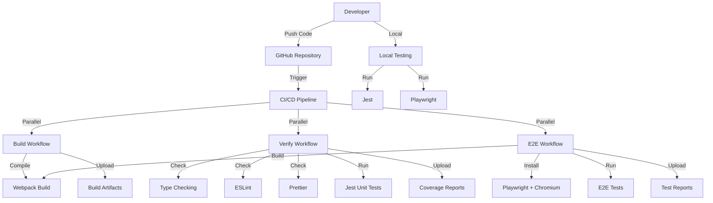

# Design Document

## Overview

This design document describes the architecture and implementation approach for establishing a comprehensive CI/CD pipeline and testing infrastructure for the Chrome Extension project. The system provides automated build verification, code quality enforcement, unit testing with Jest, and end-to-end testing with Playwright.

The design prioritizes developer experience, fast feedback loops, and confidence in code changes. The testing infrastructure runs both locally and in GitHub Actions, ensuring consistent behavior across environments.

## Architecture

### High-Level Architecture



### Component Interaction Flow

1. **Code Push**: Developer pushes code to GitHub
2. **Workflow Trigger**: GitHub Actions triggers CI workflows
3. **Parallel Execution**: Build, verify, and E2E workflows run in parallel
4. **Build Verification**: Extension is compiled and output verified
5. **Code Quality**: Type checking, linting, and formatting are validated
6. **Unit Testing**: Jest runs unit tests with Chrome API mocks
7. **E2E Testing**: Playwright loads extension in real Chrome and runs tests
8. **Artifact Collection**: Reports and artifacts are uploaded for review
9. **Local Development**: Same tests run locally with npm scripts

### Technology Stack

- **CI/CD Platform**: GitHub Actions
- **Unit Testing**: Jest 29.x with ts-jest
- **E2E Testing**: Playwright 1.40.x
- **Test Environment**: jsdom for unit tests, real Chromium for E2E
- **Coverage**: Jest built-in coverage with lcov reports
- **Mocking**: Custom Chrome API mocks for unit tests

## Components and Interfaces

### 1. Jest Configuration

**Purpose**: Configure Jest for unit testing TypeScript code with Chrome API mocks.

**Files**:
- `jest.config.js` - Main Jest configuration
- `tsconfig.jest.json` - TypeScript config for Jest
- `src/test-setup.ts` - Chrome API mocks and global test setup

**Configuration**:
```typescript
interface JestConfig {
  preset: 'ts-jest';
  testEnvironment: 'node';
  roots: string[];
  testMatch: string[];
  transform: Record<string, string>;
  collectCoverageFrom: string[];
  coverageDirectory: string;
  coverageReporters: string[];
  moduleNameMapper: Record<string, string>;
}
```

**Responsibilities**:
- Compile TypeScript test files with ts-jest
- Provide jsdom environment for DOM testing
- Collect coverage from source files
- Mock CSS imports
- Configure test file patterns

### 2. Chrome API Mocks

**Purpose**: Provide mock implementations of Chrome extension APIs for unit testing.

**Files**:
- `src/test-setup.ts` - Mock implementations

**Interface**:
```typescript
interface ChromeMocks {
  runtime: {
    onInstalled: {
      addListener: jest.Mock;
    };
    onMessage: {
      addListener: jest.Mock;
    };
    getURL: jest.Mock;
  };
  storage: {
    sync: {
      get: jest.Mock;
      set: jest.Mock;
    };
  };
  tabs: {
    create: jest.Mock;
  };
}

declare global {
  const chrome: ChromeMocks;
}
```

**Responsibilities**:
- Mock chrome.runtime API methods
- Mock chrome.storage.sync API methods
- Mock chrome.tabs API methods
- Allow tests to verify API calls
- Provide default mock implementations

### 3. Unit Tests

**Purpose**: Test individual components in isolation without a browser.

**Files**:
- `src/background/__tests__/background.test.ts` - Service worker tests
- `src/popup/__tests__/popup.test.ts` - Popup component tests
- `src/options/__tests__/options.test.ts` - Options page tests (future)

**Test Structure**:
```typescript
describe('Component Name', () => {
  beforeEach(() => {
    // Setup
    jest.clearAllMocks();
  });

  afterEach(() => {
    // Cleanup
  });

  it('should verify specific behavior', () => {
    // Arrange
    // Act
    // Assert
  });
});
```

**Responsibilities**:
- Test service worker event listeners
- Test popup button interactions
- Test Chrome API method calls
- Verify DOM structure and content
- Test error handling

### 4. Playwright Configuration

**Purpose**: Configure Playwright for E2E testing with Chrome extension support.

**Files**:
- `playwright.config.ts` - Main Playwright configuration
- `e2e/fixtures.ts` - Custom test fixtures for extension testing
- `e2e/extension.spec.ts` - E2E test suite

**Configuration**:
```typescript
interface PlaywrightConfig {
  testDir: string;
  testMatch: string;
  fullyParallel: boolean;
  forbidOnly: boolean;
  retries: number;
  workers: number;
  reporter: Array<[string, object]>;
  use: {
    trace: string;
    screenshot: string;
    video: string;
  };
  projects: Array<{
    name: string;
    use: object;
  }>;
  outputDir: string;
}
```

**Responsibilities**:
- Configure test directory and patterns
- Set retry and parallelization strategies
- Configure reporters (HTML, JUnit, list)
- Enable trace, screenshot, and video capture
- Set output directories

### 5. Playwright Test Fixtures

**Purpose**: Provide reusable test setup that loads the extension in Chrome.

**Files**:
- `e2e/fixtures.ts` - Custom fixtures

**Interface**:
```typescript
interface TestFixtures {
  context: BrowserContext;
  extensionId: string;
}

interface FixtureOptions {
  pathToExtension: string;
  launchOptions: {
    headless: boolean;
    args: string[];
    channel?: string;
  };
}
```

**Responsibilities**:
- Launch Chrome with extension loaded
- Extract extension ID from service worker
- Wait for service worker initialization
- Provide browser context to tests
- Clean up after tests complete

### 6. E2E Test Suite

**Purpose**: Verify extension functionality in a real browser environment.

**Files**:
- `e2e/extension.spec.ts` - Main test suite

**Test Categories**:
```typescript
interface E2ETestSuite {
  extensionLoading: {
    verifyPopupLoads: () => Promise<void>;
    verifyExtensionId: () => Promise<void>;
  };
  navigation: {
    verifyPopupToConfig: () => Promise<void>;
    verifyConfigPageContent: () => Promise<void>;
  };
  settings: {
    verifyCheckboxInteraction: () => Promise<void>;
    verifySettingsPersistence: () => Promise<void>;
  };
  pageNavigation: {
    verifyMultiplePages: () => Promise<void>;
  };
}
```

**Responsibilities**:
- Test extension loading and initialization
- Test navigation between popup and config pages
- Test settings interactions
- Test data persistence
- Capture screenshots and videos on failure

### 7. GitHub Actions Workflows

**Purpose**: Automate build, verification, and testing in CI/CD pipeline.

**Files**:
- `.github/workflows/build.yml` - Build workflow
- `.github/workflows/verify.yml` - Verification workflow
- `.github/workflows/e2e.yml` - E2E testing workflow
- `.github/workflows/ci.yml` - Composite CI workflow

**Workflow Structure**:
```yaml
interface WorkflowDefinition {
  name: string;
  on: {
    push: { branches: string[] };
    pull_request: { branches: string[] };
  };
  jobs: Record<string, Job>;
}

interface Job {
  'runs-on': string;
  strategy?: { matrix: object };
  steps: Step[];
}

interface Step {
  name: string;
  uses?: string;
  run?: string;
  with?: object;
  env?: object;
}
```

**Responsibilities**:
- Build extension on multiple Node versions
- Run type checking, linting, formatting
- Execute unit tests with coverage
- Execute E2E tests in CI environment
- Upload artifacts and reports
- Create release artifacts on main branch

### 8. NPM Scripts

**Purpose**: Provide convenient commands for running tests locally.

**Scripts**:
```json
{
  "test": "jest",
  "test:watch": "jest --watch",
  "test:coverage": "jest --coverage",
  "test:e2e": "playwright test",
  "test:e2e:headed": "playwright test --headed",
  "test:e2e:debug": "playwright test --debug",
  "test:e2e:ui": "playwright test --ui",
  "check": "npm run type-check && npm run lint && npm run format:check && npm test",
  "ci": "npm run check && npm run build && npm run test:e2e"
}
```

**Responsibilities**:
- Run Jest in various modes
- Run Playwright in various modes
- Run all checks together
- Simulate CI environment locally

### 9. Test Helper Scripts

**Purpose**: Provide shell scripts for running complete test suites.

**Files**:
- `scripts/test-extension-locally.sh` - Complete local test suite

**Script Flow**:
```bash
1. Clean previous artifacts
2. Build extension
3. Run unit tests
4. Run E2E tests (headed)
5. Report results
```

**Responsibilities**:
- Automate complete test workflow
- Provide clear console output
- Handle errors gracefully
- Work on Unix-based systems

## Data Models

### Test Configuration

```typescript
interface TestConfiguration {
  jest: {
    preset: string;
    testEnvironment: string;
    coverageThreshold: {
      global: {
        statements: number;
        branches: number;
        functions: number;
        lines: number;
      };
    };
  };
  playwright: {
    timeout: number;
    retries: number;
    workers: number;
    outputDir: string;
  };
}
```

### Chrome API Mock Data

```typescript
interface MockChromeStorage {
  enableFeature: boolean;
}

interface MockRuntimeMessage {
  type: string;
  payload: unknown;
}

interface MockTabCreateOptions {
  url: string;
  active?: boolean;
}
```

### Test Results

```typescript
interface JestTestResults {
  numTotalTests: number;
  numPassedTests: number;
  numFailedTests: number;
  coverage: {
    statements: number;
    branches: number;
    functions: number;
    lines: number;
  };
}

interface PlaywrightTestResults {
  total: number;
  passed: number;
  failed: number;
  skipped: number;
  duration: number;
  artifacts: {
    screenshots: string[];
    videos: string[];
    traces: string[];
  };
}
```

## Correctness Properties

*A property is a characteristic or behavior that should hold true across all valid executions of a system-essentially, a formal statement about what the system should do. Properties serve as the bridge between human-readable specifications and machine-verifiable correctness guarantees.*

### Property 1: Chrome API Mock Consistency
*For any* Chrome API method called in tests, the mock should record the call with correct arguments and allow verification.
**Validates: Requirements 2.5**

### Property 2: Test Isolation
*For any* unit test, running it in isolation should produce the same result as running it with other tests.
**Validates: Requirements 1.1, 3.1**

### Property 3: Extension Loading Reliability
*For any* E2E test run, the extension should load successfully and the extension ID should be extractable.
**Validates: Requirements 5.4, 7.4**

### Property 4: Build Artifact Completeness
*For any* successful build in CI, all required files (manifest.json, popup.js, background.js, config.js) should exist in the dist directory.
**Validates: Requirements 10.5**

### Property 5: Test Report Generation
*For any* test run (unit or E2E), test reports and artifacts should be generated and accessible.
**Validates: Requirements 5.5, 11.6, 12.5**

### Property 6: Coverage Calculation Accuracy
*For any* unit test run with coverage enabled, the coverage percentage should accurately reflect the lines executed.
**Validates: Requirements 1.4, 11.5**

## Error Handling

### Unit Test Errors

**Mock Setup Failures**:
- **Detection**: Test fails with "chrome is not defined" error
- **Handling**: Ensure test-setup.ts is imported before test code
- **Recovery**: Add import statement to test file

**Test Isolation Issues**:
- **Detection**: Tests pass individually but fail when run together
- **Handling**: Use beforeEach/afterEach to reset mocks and DOM
- **Recovery**: Clear mocks and reset DOM state between tests

**Coverage Threshold Failures**:
- **Detection**: Jest reports coverage below threshold
- **Handling**: Test run fails with coverage report
- **Recovery**: Add tests for uncovered code paths

### E2E Test Errors

**Extension Loading Failures**:
- **Detection**: Playwright cannot find extension ID
- **Handling**: Test fails with timeout error
- **Recovery**: Verify dist directory exists and contains valid manifest.json

**Service Worker Timeout**:
- **Detection**: Service worker doesn't initialize within timeout
- **Handling**: Test fails waiting for serviceworker event
- **Recovery**: Increase timeout or check service worker code for errors

**Element Not Found**:
- **Detection**: Playwright cannot locate expected element
- **Handling**: Test fails with "element not found" error
- **Recovery**: Verify element exists in HTML and selector is correct

**Page Navigation Failures**:
- **Detection**: New tab doesn't open or wrong URL
- **Handling**: Test fails with assertion error
- **Recovery**: Check chrome.tabs.create implementation and URL generation

### CI/CD Errors

**Build Failures**:
- **Detection**: Webpack compilation errors
- **Handling**: Workflow fails with error details
- **Recovery**: Fix TypeScript or webpack configuration errors

**Dependency Installation Failures**:
- **Detection**: npm ci fails
- **Handling**: Workflow fails at install step
- **Recovery**: Update package-lock.json or fix dependency conflicts

**Playwright Browser Installation Failures**:
- **Detection**: Chromium installation fails
- **Handling**: Workflow fails at browser install step
- **Recovery**: Use --with-deps flag or update Playwright version

**Artifact Upload Failures**:
- **Detection**: GitHub Actions cannot upload artifacts
- **Handling**: Warning logged but workflow continues
- **Recovery**: Check artifact size and retention settings

## Testing Strategy

### Unit Testing Approach

**Test Organization**:
- Co-locate tests with source code in `__tests__` directories
- One test file per source file
- Use descriptive test names that explain behavior

**Mocking Strategy**:
- Mock all Chrome APIs globally in test-setup.ts
- Use Jest mocks for function verification
- Reset mocks between tests for isolation

**Coverage Goals**:
- Target 80% coverage for statements, branches, functions, lines
- Focus on testing business logic and user interactions
- Exclude test files and type definitions from coverage

**Test Patterns**:
```typescript
// Arrange-Act-Assert pattern
it('should do something', () => {
  // Arrange: Set up test data and mocks
  const mockData = { value: 'test' };
  
  // Act: Execute the code under test
  const result = functionUnderTest(mockData);
  
  // Assert: Verify the result
  expect(result).toBe(expected);
});
```

### E2E Testing Approach

**Test Organization**:
- All E2E tests in `e2e/` directory
- Group related tests in describe blocks
- Use fixtures for common setup

**Extension Loading**:
- Load extension once per test using fixtures
- Extract extension ID from service worker
- Wait for service worker to be ready

**Page Interaction**:
- Use Playwright locators for element selection
- Wait for elements to be visible before interaction
- Use networkidle for page load completion

**Assertion Strategy**:
- Verify visible content with text assertions
- Verify element presence with visibility checks
- Verify URLs with contains checks
- Verify state with attribute checks

**Test Patterns**:
```typescript
test('should verify behavior', async ({ context, extensionId }) => {
  // Navigate to extension page
  const page = await context.newPage();
  await page.goto(`chrome-extension://${extensionId}/popup/popup.html`);
  
  // Wait for page load
  await page.waitForLoadState('networkidle');
  
  // Interact with elements
  const button = page.locator('#myButton');
  await expect(button).toBeVisible();
  await button.click();
  
  // Verify results
  const result = page.locator('#result');
  await expect(result).toHaveText('Expected');
});
```

### CI/CD Testing Strategy

**Workflow Orchestration**:
- Run build, verify, and E2E workflows in parallel
- Require build success before running dependent workflows
- Use matrix strategy for multi-version testing

**Artifact Management**:
- Upload build artifacts for debugging
- Upload test reports for review
- Upload coverage reports for tracking
- Set appropriate retention periods

**Performance Optimization**:
- Cache npm dependencies
- Use npm ci instead of npm install
- Run tests in parallel where possible
- Limit workers in CI environment

**Failure Handling**:
- Retry flaky E2E tests up to 2 times
- Continue workflow on artifact upload failures
- Upload artifacts even when tests fail
- Provide clear error messages

## Implementation Notes

### Jest Configuration Decisions

**Test Environment**: Using 'node' instead of 'jsdom' for better performance
- Chrome APIs are mocked globally, so jsdom DOM is not needed for most tests
- Popup tests that need DOM can set up minimal DOM in test

**Coverage Collection**: Exclude test files and generated files
- Only measure coverage of source code
- Exclude type definitions and test utilities
- Generate multiple report formats (text, lcov, html)

**Module Name Mapper**: Mock CSS imports
- CSS files are not needed in tests
- Use identity-obj-proxy to mock CSS modules
- Prevents errors when importing styled components

### Playwright Configuration Decisions

**Headless Mode**: Disabled for extension testing
- Chrome extensions don't work in headless mode
- Use headed mode even in CI
- Use Xvfb in CI for virtual display

**Browser Channel**: Use 'chrome' locally, chromium in CI
- Chrome channel provides better extension support locally
- Chromium is more reliable in CI environments
- Fallback to chromium if chrome not available

**Extension Loading**: Use launchPersistentContext
- Required for loading unpacked extensions
- Provides persistent user data directory
- Allows extension to maintain state

**Service Worker Detection**: Wait for serviceworker event
- Service worker may not be immediately available
- Wait up to 10 seconds for initialization
- Extract extension ID from service worker URL

### GitHub Actions Decisions

**Node Version Matrix**: Test on 18.x and 20.x
- Ensure compatibility with LTS versions
- 18.x is current LTS, 20.x is next LTS
- Use 18.x for single-version jobs

**Artifact Retention**: Different periods for different artifacts
- Build artifacts: 7 days (short-term debugging)
- Coverage reports: 7 days (short-term tracking)
- Test reports: 30 days (longer-term analysis)
- Release artifacts: 90 days (distribution)

**Workflow Triggers**: Push and pull request
- Run on main and develop branches
- Run on all pull requests to main
- Allow manual workflow dispatch

**Concurrency Control**: Cancel in-progress runs
- Cancel previous runs when new code is pushed
- Saves CI minutes and provides faster feedback
- Group by workflow and ref

### Local Development Workflow

**Running Tests During Development**:
1. Run unit tests in watch mode: `npm run test:watch`
2. Make code changes
3. Tests automatically re-run
4. Fix failures and iterate

**Running E2E Tests Locally**:
1. Build extension: `npm run build`
2. Run E2E tests: `npm run test:e2e:headed`
3. Watch browser interactions
4. Debug with `npm run test:e2e:debug`

**Pre-Commit Checks**:
1. Run `npm run check` before committing
2. Fix any linting or type errors
3. Ensure all tests pass
4. Commit changes

**Debugging Test Failures**:
1. Use Playwright UI mode: `npm run test:e2e:ui`
2. Step through test execution
3. Inspect element states
4. View network requests
5. Check console logs

### Future Extensibility

This testing infrastructure supports adding:
- **Visual Regression Testing**: Add Playwright screenshot comparison
- **Performance Testing**: Add Lighthouse CI for performance metrics
- **Accessibility Testing**: Add axe-core for a11y testing
- **Cross-Browser Testing**: Add Firefox and Safari to Playwright config
- **Mutation Testing**: Add Stryker for mutation testing
- **Contract Testing**: Add Pact for API contract testing
